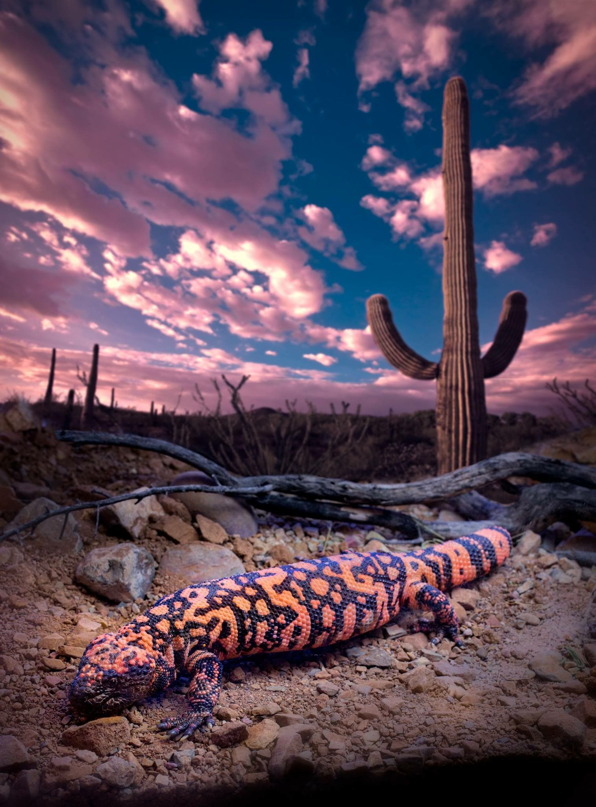
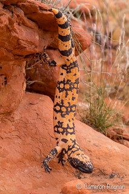
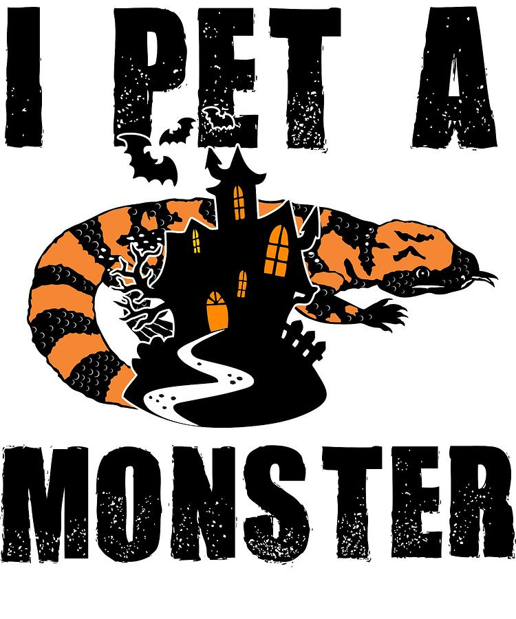

```{r setup, include=FALSE}
knitr::opts_chunk$set(echo = TRUE)
pacman::p_load("leaflet","OpenStreetMap","sf","tidyverse", "raster")
```

## Heloderma Retrieval

Once again, I am using Heloderma museum specimen data from Dr. Gienger's specimen database. This data set has location information for where these specimens were collected.



.jpg)

```{r cars}
heloderma <- read.csv("Heloderma_morph_data.csv")

specimensmap<- openmap(c( 19.23466,-103.7247),
                     c(37.08093, -115.5846), type='bing')
specimens <- openproj(specimensmap, projection = "+proj=longlat +ellps=WGS84 +units=m +no_defs")
```

## Trying All Data Points

```{r plot}
autoplot.OpenStreetMap(specimens) +
  geom_point(data=heloderma, aes(x = Longitude, y = Latitude, color=Lizard_ID), size = 2, alpha = 0.7) +
  geom_text(data=heloderma,aes(x = Longitude, y = Latitude, label=Lizard_ID),  color="white", size = 2, vjust=-0.01) +
  labs(x="Longtitude", y="Latitude") + theme(legend.position = "none")
```

## Focusing on Heloderma in Mexico

```{r filter, include=FALSE}
MXheloderma<- filter(heloderma, State !="Arizona")
MXheloderma<- filter(MXheloderma, State != "Utah")
MXheloderma<- filter(MXheloderma, State != "New Mexico")

```

```{r MX, echo=FALSE}
MXspecimensmap<- openmap(c( 19.23466,-103.7247),
                     c(31.72820, -113.0817), type='bing')
MXspecimens <- openproj(specimensmap, projection = "+proj=longlat +ellps=WGS84 +units=m +no_defs")
```

## A Fixed Satellite Map

This map features separate data points with Lizard_ID being the point label.

```{r pressure, echo=FALSE}
autoplot.OpenStreetMap(MXspecimens) +
  geom_point(data=MXheloderma, aes(x = Longitude, y = Latitude, color=Lizard_ID), size = 2, alpha = 0.7) +
  geom_text(data=MXheloderma,aes(x = Longitude, y = Latitude, label=Lizard_ID),  color="white", size = 2, vjust=-0.01) +
  labs(x="Longtitude", y="Latitude") + theme(legend.position = "none") 
```

## The Interactive Map

This map is interactive with the immediate label being what Heloderma species the specimen is and the pop up detail is the Lizard_ID, which is like what is in the fixed map.

```{r}
leaflet(MXheloderma) %>% 
  addTiles() %>% 
 addCircleMarkers(popup = MXheloderma$Lizard_ID,
                   label = MXheloderma$Species,
                   lng = MXheloderma$Longitude, 
                   lat = MXheloderma$Latitude,
                   weight = 2,
                   color = "grey",
                   fillColor = "orange",
                   fillOpacity = 0.9)
```

## Hang in There



## Happy Halloween!


